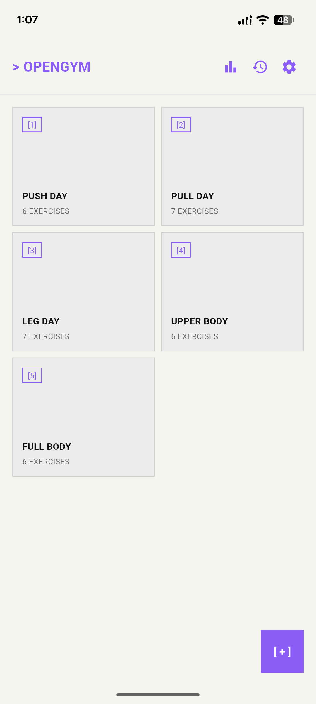
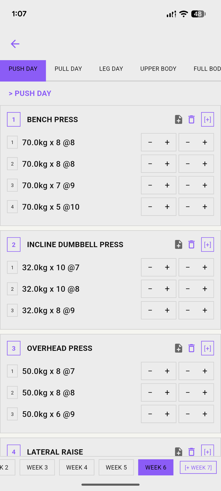
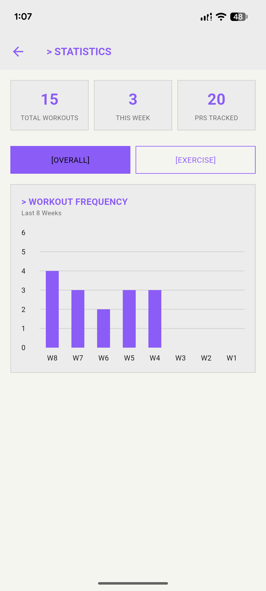
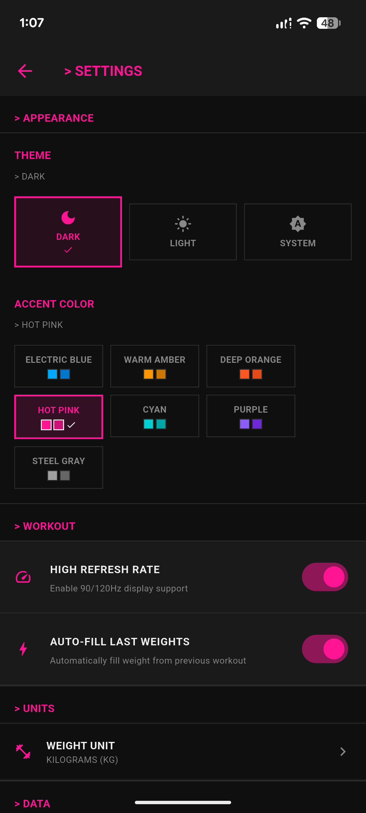
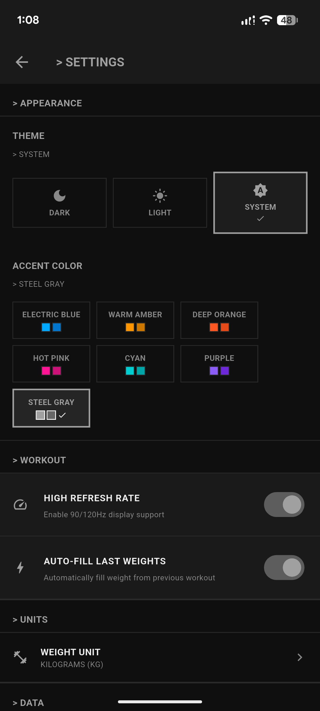
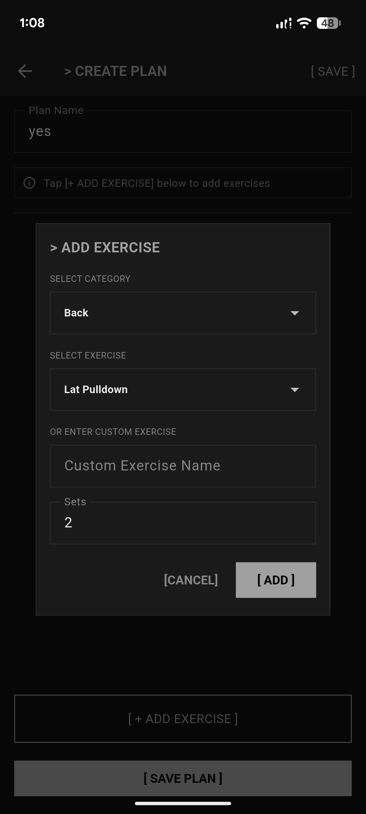

<p align="center">
  <picture>
    <source media="(prefers-color-scheme: dark)" srcset="logo/opengym_icon_v2.png">
    
  </picture>
</p>

<h1 align="center">🏋️ OpenGym</h1>

<p align="center">
  <em>A terminal-style workout tracking app, completely <strong>vibecoded</strong> with the help of <a href="https://opencode.ai"><strong>Opencode</strong></a></em>
</p>

<p align="center">
  <a href="#features">Features</a> •
  <a href="#screenshots">Screenshots</a> •
  <a href="#tech-stack">Tech Stack</a> •
  <a href="#getting-started">Getting Started</a> •
  <a href="#project-structure">Structure</a> •
  <a href="#building">Building</a>
</p>

<p align="center">
  
  
  
  
  
</p>

<br>

> **OpenGym** is a sleek, offline-first workout tracker built with Flutter. Log your sets, reps, and weights with a distinctive terminal-inspired interface. Track personal records, visualize your progress, and manage your training plans — all without an internet connection.

---

## ✨ Features

### 💪 Workout Tracking
- **Plan Management** — Create, edit, copy, and delete custom workout plans
- **65+ Pre-built Exercises** — Across 6 muscle categories (Chest, Back, Shoulders, Arms, Legs, Core) + custom exercise entry
- **Set Logging** — Track weight (kg/lbs), reps, RPE (1-10), and notes per set
- **Week-Based Periodization** — Organize sessions by week with auto-copy from previous week
- **Auto-Save** — Never lose progress; saves automatically on navigation
- **PR Detection** — 🎉 Automatic personal record celebration when you hit new weights
- **Progression Suggestions** — Smart double-progression logic recommends next weight/reps
- **Auto-Fill** — Pre-fills weights from your last session for faster logging

### 📊 Statistics & History
- **Workout Frequency Chart** — Weekly bar chart showing your consistency (last 8 weeks)
- **Exercise Progression Chart** — Line chart tracking max weight over time per exercise
- **Summary Stats** — Total workouts, weekly count, PRs tracked
- **Full History** — Expandable session cards with edit/delete for past workouts

### 🎨 Customization
- **Dark / Light / System Theme** — Seamless automatic or manual theming
- **12 Accent Colors** — Electric Blue, Warm Amber, Deep Orange, Hot Pink, Cyan, Purple, Steel Gray, and more
- **Weight Units** — Switch between kg and lbs on the fly
- **High Refresh Rate** — 90/120Hz display support for buttery smooth scrolling
- **JetBrains Mono** — Terminal-inspired monospace typography throughout

### 📁 Data
- **100% Offline** — All data stored locally with Hive; no account, no cloud, no tracking
- **Sample Data** — Load 5 sample plans with 15 sessions across 5 weeks to explore the app
- **Export / Clear** — Full control over your data

---

## 📸 Screenshots

<p align="center">
  
  
  
</p>

<p align="center">
  
  
  
</p>

---

## 🛠 Tech Stack

| Technology | Purpose |
|---|---|
| [Flutter](https://flutter.dev) 3.5+ | Cross-platform UI framework |
| [Dart](https://dart.dev) 3.5+ | Programming language |
| [Provider](https://pub.dev/packages/provider) | State management (ChangeNotifier) |
| [Hive](https://pub.dev/packages/hive) | Local NoSQL database |
| [fl_chart](https://pub.dev/packages/fl_chart) | Interactive charts |
| [Google Fonts](https://pub.dev/packages/google_fonts) | JetBrains Mono typeface |
| [SharedPreferences](https://pub.dev/packages/shared_preferences) | Settings persistence |

### Architecture

```
lib/
├── models/        → Hive data models (Set, Exercise, Plan, Session)
├── providers/     → ChangeNotifier state management
├── repositories/  → Clean architecture data layer
├── services/      → Business logic (HiveService, PR Tracking)
├── screens/       → 7 UI screens (Home, Workout, Stats, etc.)
├── widgets/       → Reusable components (SetRow, ExerciseCard, Dialogs)
├── theme/         → Terminal-style theme with 12 accent colors
├── data/          → Exercise library (65+ exercises)
└── utils/         → Animations and helpers
```

---

## 🚀 Getting Started

### Prerequisites

- [Flutter SDK](https://docs.flutter.dev/get-started/install) 3.5 or later
- Dart SDK (included with Flutter)
- Android Studio, Xcode, or VS Code (for your target platform)

### Installation

```bash
# Clone the repository
git clone https://github.com/AalishMS/OpenGym.git
cd OpenGym

# Install dependencies
flutter pub get

# Generate Hive adapters
flutter pub run build_runner build --delete-conflicting-outputs

# Run the app
flutter run
```

---

## 🏗 Building

### Android APK
```bash
flutter build apk --release
```
APK output: `build/app/outputs/flutter-apk/app-release.apk`

### iOS
```bash
flutter build ios --release
```

### Web
```bash
flutter build web --release
```

---

## 📁 Project Structure

```
gymapp-offline/
├── lib/
│   ├── main.dart                   # App entry point
│   ├── models/                     # Hive type adapters
│   │   ├── set.dart
│   │   ├── exercise.dart
│   │   ├── exercise_template.dart
│   │   ├── workout_plan.dart
│   │   └── workout_session.dart
│   ├── providers/                  # State management
│   │   ├── workout_plan_provider.dart
│   │   ├── workout_session_provider.dart
│   │   ├── progression_provider.dart
│   │   └── settings_provider.dart
│   ├── repositories/               # Data access layer
│   │   ├── workout_plan_repository.dart
│   │   ├── workout_session_repository.dart
│   │   └── stats_repository.dart
│   ├── services/                   # Business logic
│   │   ├── hive_service.dart
│   │   ├── pr_tracking_service.dart
│   │   └── sample_data_seeder.dart
│   ├── screens/                    # UI screens
│   │   ├── home_screen.dart
│   │   ├── create_plan_screen.dart
│   │   ├── edit_plan_screen.dart
│   │   ├── workout_screen.dart
│   │   ├── history_screen.dart
│   │   ├── stats_screen.dart
│   │   └── settings_screen.dart
│   ├── widgets/workout/            # Reusable widgets
│   │   ├── set_row.dart
│   │   ├── exercise_card.dart
│   │   ├── arrow_button.dart
│   │   └── workout_dialogs.dart
│   ├── theme/
│   │   └── app_theme.dart
│   ├── data/
│   │   └── exercise_library.dart
│   └── utils/
│       └── fade_page_route.dart
├── logo/                           # App icon assets
├── test/                           # Tests
└── web/                            # PWA web assets
```

---

## 🧪 Running Tests

```bash
# Run all tests
flutter test

# Run a specific test file
flutter test test/widget_test.dart

# Run tests matching a name
flutter test --name="Basic"
```

---

## 📝 License

Distributed under the **MIT License**. See `LICENSE` for more information.

---

<p align="center">
  Built with ❤️ using Flutter &middot;
  <a href="https://opencode.ai">Powered by Opencode</a>
</p>
