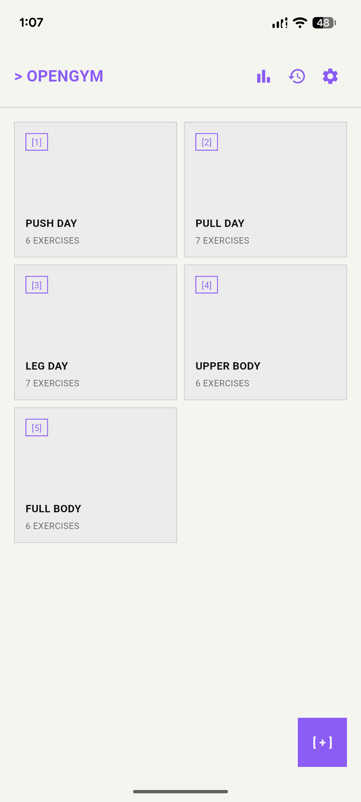
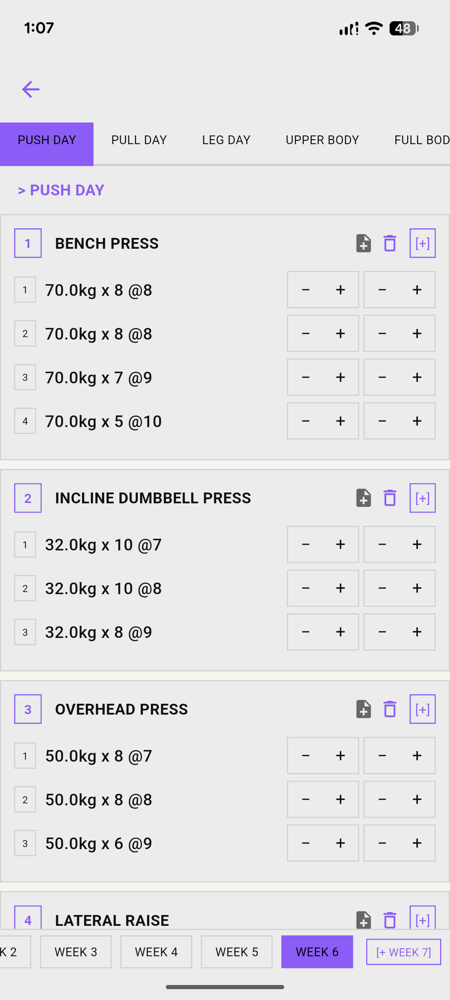
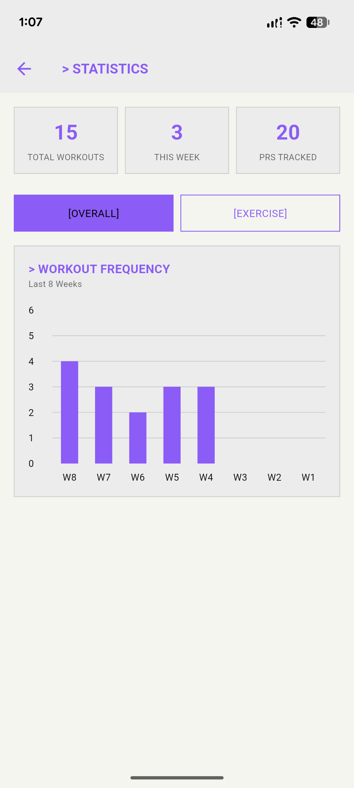
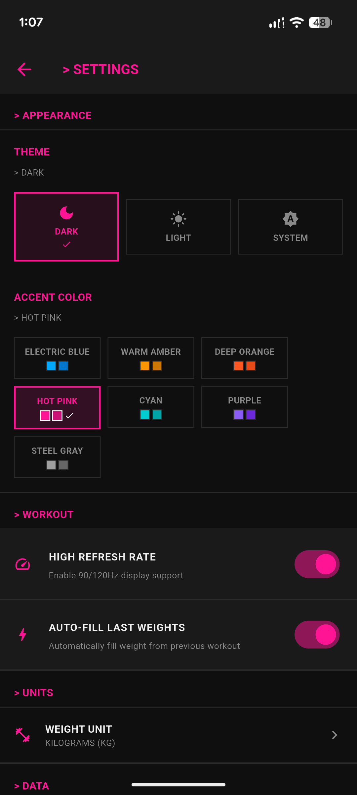
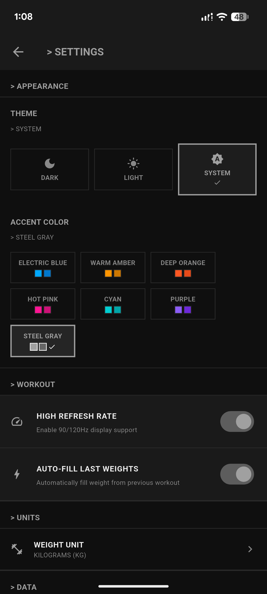
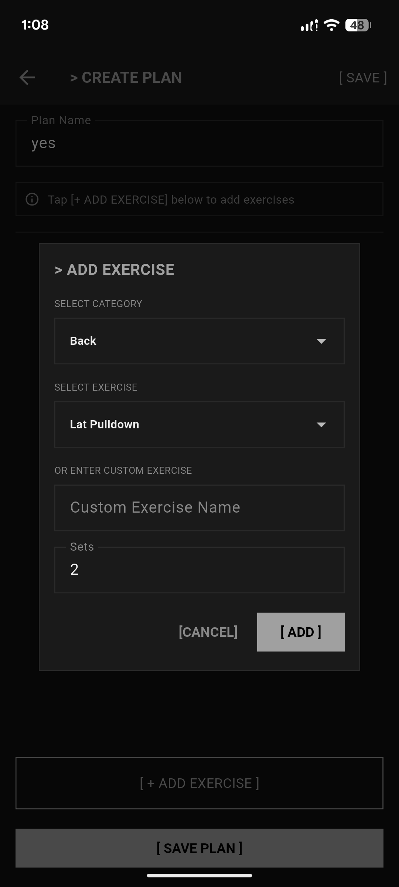

<p align="center">
  
</p>

<h1 align="center">OpenGym</h1>

<p align="center">
  <em>A terminal-style workout tracking app <strong>vibecoded</strong> with the help of <a href="https://opencode.ai"><strong>Opencode</strong></a></em>
</p>

<p align="center">
  <a href="#features">Features</a> •
  <a href="#screenshots">Screenshots</a> •
  <a href="#tech-stack">Tech Stack</a> •
  <a href="#getting-started">Getting Started</a> •
  <a href="#project-structure">Structure</a> •
  <a href="#building">Building</a>
</p>

<p align="center">
  
  
  
  
  
</p>

<br>

> **OpenGym** is an offline-first workout tracker built with Flutter. Log sets, reps, and weights through a terminal-inspired interface. Track personal records, view progress over time, and manage training plans on your device, with cloud sync across devices when you sign in.

---

## Features

### Workout Tracking
- **Plan Management** : Create, edit, copy, and delete custom workout plans
- **65+ Pre-built Exercises** : Across 6 muscle categories (Chest, Back, Shoulders, Arms, Legs, Core) + custom exercise entry
- **Set Logging** : Track weight (kg/lbs), reps, RPE (1-10), and notes per set
- **Week-Based Periodization** : Organize sessions by week with auto-copy from previous week
- **Auto-Save** : Workouts save on every screen change
- **PR Detection** : Flags new personal records when you log a heavier weight
- **Progression Suggestions** : Double-progression logic recommends the next weight/reps
- **Auto-Fill** : Pre-fills weights from your last session for faster logging

### Statistics & History
- **Workout Frequency Chart** : Weekly bar chart showing your consistency (last 8 weeks)
- **Exercise Progression Chart** : Line chart tracking max weight over time per exercise
- **Summary Stats** : Total workouts, weekly count, PRs tracked
- **Full History** : Expandable session cards with edit/delete for past workouts

### Customization
- **Dark / Light / System Theme** : Automatic or manual theming
- **12 Accent Colors** : Electric Blue, Warm Amber, Deep Orange, Hot Pink, Cyan, Purple, Steel Gray, and more
- **Weight Units** : Switch between kg and lbs on the fly
- **High Refresh Rate** : 90/120Hz display support
- **JetBrains Mono** : Terminal-inspired monospace typography throughout

### Sync
- **Supabase Backend** : Email auth, Postgres tables, and row-level security scoped to your account
- **Automatic Push/Pull** : Changes sync on save and when the app returns to the foreground; edits made offline drain on reconnect
- **Last-Write-Wins** : Edits from two devices resolve to the later timestamp

### Data
- **On-Device First** : All records live in local Hive storage, so the app keeps working without a connection
- **Sample Data** : Load 5 sample plans with 15 sessions across 5 weeks to explore the app
- **Export / Clear** : Full control over your data

---

## Screenshots

<p align="center">
  
  
  
</p>

<p align="center">
  
  
  
</p>

---

## Tech Stack

| Technology | Purpose |
|---|---|
| [Flutter](https://flutter.dev) 3.5+ | Cross-platform UI framework |
| [Dart](https://dart.dev) 3.5+ | Programming language |
| [Provider](https://pub.dev/packages/provider) | State management (ChangeNotifier) |
| [Hive](https://pub.dev/packages/hive) | Local NoSQL database |
| [fl_chart](https://pub.dev/packages/fl_chart) | Interactive charts |
| [Google Fonts](https://pub.dev/packages/google_fonts) | JetBrains Mono typeface |
| [SharedPreferences](https://pub.dev/packages/shared_preferences) | Settings persistence |
| [Supabase](https://supabase.com) | Auth, Postgres, and RLS for cloud sync |

### Architecture

```
lib/
├── models/        → Hive data models (Set, Exercise, Plan, Session)
├── providers/     → ChangeNotifier state management
├── repositories/  → Clean architecture data layer
├── services/      → Business logic (HiveService, SyncService, PR Tracking)
├── screens/       → 7 UI screens (Home, Workout, Stats, etc.)
├── widgets/       → Reusable components (SetRow, ExerciseCard, Dialogs)
├── theme/         → Terminal-style theme with 12 accent colors
├── data/          → Exercise library (65+ exercises)
└── utils/         → Animations and helpers
```

---

## Getting Started

### Prerequisites

- [Flutter SDK](https://docs.flutter.dev/get-started/install) 3.5 or later
- Dart SDK (included with Flutter)
- Android Studio, Xcode, or VS Code (for your target platform)

### Installation

```bash
# Clone the repository
git clone https://github.com/AalishMS/OpenGym.git
cd OpenGym

# Install dependencies
flutter pub get

# Generate Hive adapters
flutter pub run build_runner build --delete-conflicting-outputs

# Run the app
flutter run
```

---

## Building

### Android APK
```bash
flutter build apk --release
```
APK output: `build/app/outputs/flutter-apk/app-release.apk`

### iOS
```bash
flutter build ios --release
```

### Web
```bash
flutter build web --release
```

---

## Releasing

OpenGym updates itself. Installed copies poll the GitHub Releases API, and when
a newer build is published they offer to download and install it — no app store
involved. Publishing is a tag push; GitHub Actions does the rest.

### Cutting a release

1. Bump `version:` in `pubspec.yaml`. **Always increment the `+build` number** —
   it becomes the Android `versionCode`, it is what the updater compares, and
   Android refuses to install an APK whose versionCode did not increase. A new
   version name with the same build number is an unpublishable release.

   ```yaml
   version: 1.0.1+2
   ```

2. Commit, then tag with `v` + the exact pubspec version and push:

   ```bash
   git commit -am "release: 1.0.1+2" && git tag v1.0.1+2 && git push && git push --tags
   ```

`.github/workflows/release.yml` then verifies the tag matches pubspec (and fails
loudly if not), runs the tests, builds a single universal signed APK, checks it
is signed with the release key rather than the debug fallback, and publishes it
as a GitHub Release. Installed apps pick it up on their next check.

Two things will make a release invisible to the updater, so the workflow avoids
both: marking it as a **draft** or a **prerelease** (the `/releases/latest`
endpoint skips those), and attaching more than one `.apk` (which is why the
build is universal rather than `--split-per-abi`).

### One-time setup

Signing keys are not in the repository. Generate a keystore once and keep it
forever — **every** APK must be signed with the same key, or installed copies
cannot update and the only way forward is uninstall-and-reinstall, which erases
local data.

```bash
keytool -genkeypair -v -keystore android/app/opengym-release.jks -keyalg RSA -keysize 2048 -validity 10000 -alias opengym
```

Then create `android/key.properties` (git-ignored) so local release builds sign:

```properties
storeFile=opengym-release.jks
storePassword=<your keystore password>
keyAlias=opengym
keyPassword=<your key password>
```

Back the `.jks` file and its passwords up somewhere offline. Losing them ends
the update path for every installed copy.

For CI, add these four repository secrets under
**Settings → Secrets and variables → Actions**:

| Secret | Value |
| --- | --- |
| `KEYSTORE_BASE64` | `base64 -w0 android/app/opengym-release.jks` |
| `KEYSTORE_PASSWORD` | the keystore password |
| `KEY_ALIAS` | the key alias (`opengym` above) |
| `KEY_PASSWORD` | the key password |

`android/key.properties`, `*.jks`, and `*.keystore` are git-ignored. Never
commit them, and never paste the base64 anywhere but the secret field.

### Updating from a pre-1.0.1 hand-installed build

Builds distributed before this release were signed with the debug key and used a
different application ID (`com.example.gymapp.offline`). Android treats the new
release as a **different app**, so it installs alongside the old one and starts
empty. Migrating once:

1. In the old app: **Settings → EXPORT DATA**, and keep the file somewhere safe.
2. Install the new APK, then **Settings → IMPORT DATA** and pick that file.
3. Uninstall the old app.

Do the export *first*. Uninstalling the old app deletes its local database.

---

## Project Structure

```
gymapp-offline/
├── lib/
│   ├── main.dart                   # App entry point
│   ├── models/                     # Hive type adapters
│   │   ├── set.dart
│   │   ├── exercise.dart
│   │   ├── exercise_template.dart
│   │   ├── workout_plan.dart
│   │   └── workout_session.dart
│   ├── providers/                  # State management
│   │   ├── workout_plan_provider.dart
│   │   ├── workout_session_provider.dart
│   │   ├── progression_provider.dart
│   │   └── settings_provider.dart
│   ├── repositories/               # Data access layer
│   │   ├── workout_plan_repository.dart
│   │   ├── workout_session_repository.dart
│   │   └── stats_repository.dart
│   ├── services/                   # Business logic
│   │   ├── hive_service.dart
│   │   ├── pr_tracking_service.dart
│   │   └── sample_data_seeder.dart
│   ├── screens/                    # UI screens
│   │   ├── home_screen.dart
│   │   ├── create_plan_screen.dart
│   │   ├── edit_plan_screen.dart
│   │   ├── workout_screen.dart
│   │   ├── history_screen.dart
│   │   ├── stats_screen.dart
│   │   └── settings_screen.dart
│   ├── widgets/workout/            # Reusable widgets
│   │   ├── set_row.dart
│   │   ├── exercise_card.dart
│   │   ├── arrow_button.dart
│   │   └── workout_dialogs.dart
│   ├── theme/
│   │   └── app_theme.dart
│   ├── data/
│   │   └── exercise_library.dart
│   └── utils/
│       └── fade_page_route.dart
├── logo/                           # App icon assets
├── test/                           # Tests
└── web/                            # PWA web assets
```

---

## Running Tests

```bash
# Run all tests
flutter test

# Run a specific test file
flutter test test/widget_test.dart

# Run tests matching a name
flutter test --name="Basic"
```

---

## License

Distributed under the **MIT License**. See `LICENSE` for more information.

---

<p align="center">
  Built with Flutter
</p>
