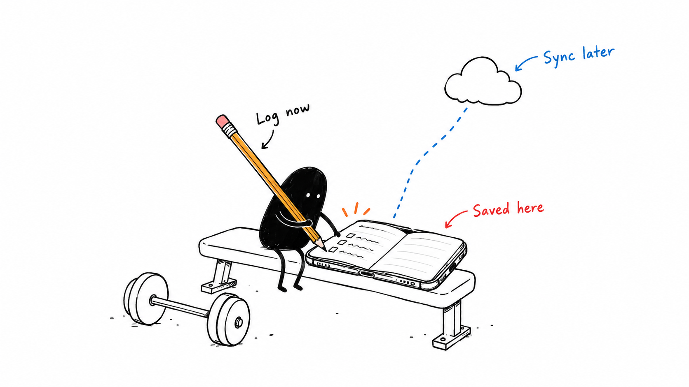
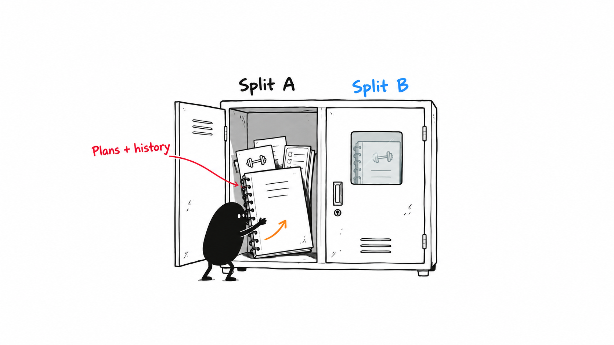
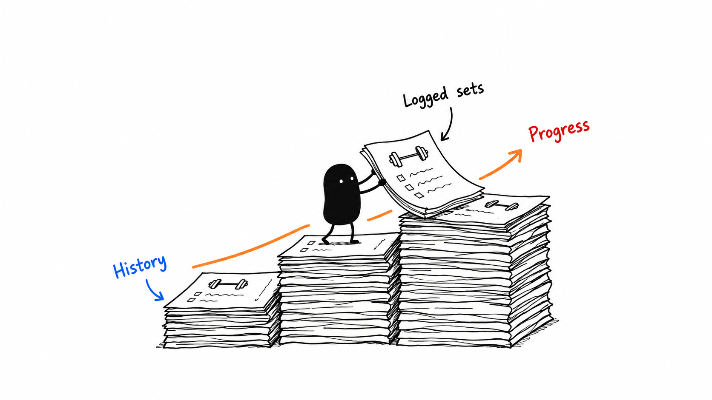

# OpenGym illustrations

Three documentation illustrations generated with the built-in ImageGen tool using
the [Ian Xiaohei illustration skill](../.agents/skills/ian-xiaohei-illustrations/SKILL.md).

## Offline logging

Workout logs remain available on the device. Optional account sync can send
changes when a connection becomes available.



## Split workspaces

Each split keeps its own plans and sessions. History, statistics, and records
follow the active split. See [Split workspaces](splits.md).



## Workout progress

Saved sets form a workout history that can be reviewed through exercise progress,
statistics, and personal records.



## Visual review

All three use fresh metaphors, readable English labels, and Xiaohei performing
the central action. Each PNG is 1672 × 941 pixels, approximately 16:9 (rounded
pixel dimensions). Offline logging and split workspaces most directly explain
product behavior; the progress staircase is an optional conceptual illustration.

| Image | Aspect ratio | White background | Core action | Labels | No title | Fresh metaphor | Saved file |
| --- | --- | --- | --- | --- | --- | --- | --- |
| Offline logging | Pass, approximately 16:9 | Pass | Pass, writing the log | Pass, 3 readable labels | Pass | Pass | [01-offline-logging.png](../assets/opengym-illustrations/01-offline-logging.png) |
| Split workspaces | Pass, approximately 16:9 | Pass | Pass, storing the log | Pass, 3 readable labels | Pass | Pass | [02-split-workspaces.png](../assets/opengym-illustrations/02-split-workspaces.png) |
| Workout progress | Pass, approximately 16:9 | Pass | Pass, placing log pages | Pass, 3 readable labels | Pass | Pass | [03-workout-progress.png](../assets/opengym-illustrations/03-workout-progress.png) |

## Attribution

Illustrations generated for OpenGym using Ian's Xiaohei visual language via
[tojileon/ian-xiaohei-illustrations-en](https://github.com/tojileon/ian-xiaohei-illustrations-en).
Original skill by [Ian](https://github.com/helloianneo).
The upstream [license](../.agents/skills/ian-xiaohei-illustrations/LICENSE) and
[notice](../.agents/skills/ian-xiaohei-illustrations/NOTICE.md) are preserved.

## Generation prompts

These prompts were used with the built-in ImageGen tool, one image per call.

### Image 1

```text
Use case: illustration-story. Generate one standalone 16:9 horizontal English article illustration, ideally 1536x864, for OpenGym documentation. Pure white background; thin slightly wobbly black hand-drawn pen lines; sparse red/orange/blue handwritten English annotations; at least 40% blank white space. No gradients, shadows, paper texture, commercial vector polish, PPT, flowchart, cute cartoon, realistic interface, title, top-left heading, or watermark.
Xiaohei is a small irregular solid-black bean creature with two tiny white-dot eyes, thin arms and legs, no mouth, a deadpan serious worker. Xiaohei must perform the central action.
Core idea: workout logs save to the user's device even offline; optional cloud sync can happen later. Fresh conceptual metaphor: a phone-shaped physical ledger resting on a very simple gym bench, its open paper pages inside the phone outline. Xiaohei sits on the bench writing a completed set in the ledger with an absurdly long pencil. A small barbell lies nearby. Above and right is one tiny outlined cloud with a disconnected dotted line down to the ledger; the local writing action is independent of the cloud. An orange short movement mark leads from pencil to page; a blue dotted line signals deferred cloud sync, not active upload. Scene occupies central 50% of canvas. Only three exact handwritten labels, placed next to the corresponding objects: "Log now" beside pencil in black, "Saved here" beside ledger in red, "Sync later" beside cloud in blue. No other text or numbers. Invent this scene, do not reuse conveyor belts, funnels, fish, information wells, bridges, decision levers or handoff paths.
```

### Image 2

```text
Use case: illustration-story. One standalone 16:9 horizontal English article illustration for OpenGym's split workspace guide. Pure white background, thin slightly wobbly black hand-drawn line art, lots of empty space (at least 40%), sparse handwritten English labels. No texture, gradients, shadows, PPT layout, formal flowchart, UI screenshot, vector polish, cute mascot, title, top-left heading, or watermark.
Xiaohei is a small irregular solid-black bean with two tiny white dot eyes, thin arms and legs, no mouth, serious deadpan worker.
Core idea: each training split holds its own plans and workout history; switching opens a different independent workspace. Fresh system-fragment metaphor: one modest old gym locker with exactly two side-by-side compartments, separated by a solid partition. The left compartment is open. Xiaohei leans bodily into it, using both hands to carefully insert a bound workout log and a few plan cards, actively managing its contents. The right compartment is closed, containing a faint outline of its own separate log visible through one small window. The open door does not cover the other compartment. No data moving between compartments. Locker occupies about 45% of canvas width, centered with wide white margins, only three simple handwritten labels: "Split A" in black above the left compartment, "Split B" in blue above the right compartment, "Plans + history" in red with a short leader pointing to the papers in the left. One tiny orange curved motion arrow beside Xiaohei's hand indicates inserting the log. No other text or objects. Restrained absurd humor: the paper log is almost as large as Xiaohei. Character participates in the action; no decorative mascot standing aside. Do not reuse any conveyor, funnel, fish, bridge, handoff path, lever or information well composition.
```

### Image 3

```text
Use case: illustration-story. Generate one standalone 16:9 horizontal English article illustration for OpenGym workout progress documentation. Pure white background, thin slightly wobbly black hand-drawn pen line art, sparse red/orange/blue handwritten English annotations, at least 40% empty white space. No gradients, shadow, gray fills, paper texture, PPT, chart dashboard, formal flowchart, real UI, vector polish, cute cartoon, top-left title, heading or watermark.
Xiaohei is a small irregular solid-black bean with two tiny white-dot eyes, thin arms and legs, blank deadpan expression, no mouth, no clothes.
One core idea: saved workout sessions form the history that reveals progress over time. Fresh conceptual metaphor: Xiaohei physically builds a low staircase made entirely of stacks of workout-log pages, three modest steps ascending left to right. He stands on the middle step and adds one thick page to the next step with both hands; the page is slightly oversized and bending under its own weight. Small simple barbell doodles and short unreadable pen marks on some sheets suggest workout logs, but absolutely no numbers, chart axes or detailed text. A short orange curving arrow follows the rising steps, indicating progression; leave the entire upper third almost empty. Structure is conceptual metaphor, not formal diagram. Keep main scene centered in about half the frame. Exactly three short handwritten labels: "Logged sets" in black pointing to the loose page Xiaohei is placing, "History" in blue pointing to the stacked pages, "Progress" in red next to the end of the orange rising arrow. No other words. Deadpan absurdity, clean simple scene; Xiaohei must be indispensable to the action. Do not reuse conveyor belts, funnels, fish, decision levers, handoff paths, information wells, or bridge scenes.
```


